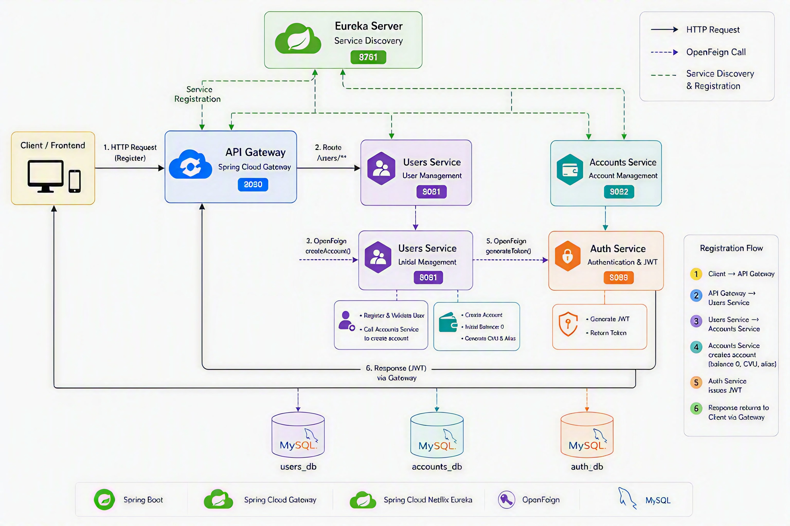

# Digital Money House - Backend Ecosystem 🚀

La aplicación permite registrar usuarios, autenticarlos mediante JWT, administrar cuentas digitales, consultar saldos, 
gestionar tarjetas, realizar depósitos, ejecutar transferencias entre cuentas y visualizar historial de actividades financieras.

---

## 🏗️ Arquitectura del Sistema

El ecosistema está compuesto por los siguientes módulos interconectados:

* **`eureka-server`**: Servidor de descubrimiento (Service Discovery) que centraliza el registro dinámico de todas las instancias de microservicios.
* **`api-gateway`**: Punto de entrada único del sistema. Se encarga del enrutamiento inteligente y la seguridad unificada.
* **`auth-service`**: Microservicio dedicado a la autenticación, validación de credenciales (BCrypt) y emisión de tokens **JWT (JJWT 0.12.x)** sin estado.
* **`users-service`**: Gestiona el ciclo de vida de los usuarios y coordina los flujos de registro público mediante validaciones de integridad de datos.
* **`accounts-service`**: Administra las billeteras virtuales, saldos y core financiero. Implementa los algoritmos asincrónicos/sincrónicos de negocio para la generación única de datos bancarios.

## 🏗️ Arquitectura de Digital Money House



---


## 🛠️ Tecnologías y Herramientas Utilizadas

* **Java 17** (LTS)
* **Spring Boot 3.2.0**
* **Spring Cloud 2023.0.0** (OpenFeign, Netflix Eureka Client & Server, Spring Cloud Gateway)
* **Spring Security 6** & **io.jsonwebtoken (JJWT 0.12.3)**
* **Spring Data JPA** & **Hibernate**
* **MySQL 8** (Bases de datos independientes: `users_db` y `accounts_db`)
* **Lombok** (Optimización de código Boilerplate)
* **SpringDoc OpenAPI 3** (Documentación interactiva con Swagger)
* **RestAssured 5.4.0** & **Spring Security Test** (Frameworks de pruebas automatizadas)

---

## 🗺️ Mapa de Puertos y Endpoints del Ecosistema

| Microservicio | Puerto Base | Endpoint Core | Tipo | Descripción |
| :--- | :--- | :--- | :--- | :--- |
| `eureka-server` | `8761` | `/` | UI | Panel de control de instancias registradas. |
| `api-gateway` | `8080` | `/**` | Proxy | Enrutador perimetral del ecosistema. |
| `auth-service` | `8088` | `/auth/login` | `POST` | Autenticación de usuarios y entrega de JWT. |
| `users-service` | `8081` | `/users/register` | `POST` | Registro de clientes e inicialización distribuida. |
| `accounts-service` | `8082` | `/accounts/internal/create` | `POST` | Endpoint interno (Feign) para setup de billetera. |

---

## 🚀 Instrucciones de Configuración y Despliegue Local

### 1. Requisitos Previos
* Contar con el **Java Development Kit (JDK) 17** instalado.
* Tener configurado un gestor de bases de datos **MySQL** corriendo localmente en los puertos correspondientes (`3306`/`3307` o el configurado en tus perfiles `yml`).

### 2. Preparación de las Bases de Datos
Asegurate de que tu servidor MySQL local tenga disponibles los siguientes esquemas independientes. Las tablas físicas serán autogeneradas por Hibernate al iniciar los servicios (`ddl-auto: update`):
```sql
CREATE DATABASE dmh_users_db;
CREATE DATABASE dmh_accounts_db;
```
---

# ✅ Testing y Calidad

El proyecto fue validado mediante pruebas manuales y automatizadas cubriendo la totalidad de las funcionalidades implementadas durante los Sprint 1 a Sprint 4.

| Métrica | Resultado |
|----------|----------|
| Casos de prueba totales | 69 |
| Casos ejecutados | 69 |
| Casos aprobados (PASS) | 69 |
| Casos fallidos (FAIL) | 0 |
| Casos bloqueados (BLOCKED) | 0 |
| Defectos reportados | 11 |
| Defectos corregidos | 11 |
| Defectos abiertos | 0 |
| Smoke Suite | PASS |
| Regression Suite | PASS |
| Estado QA | ✅ APROBADO |

## Herramientas de Testing

- JUnit 5
- RestAssured
- Selenium WebDriver
- Spring Security Test
- Postman
- Swagger / OpenAPI

---

# 🔀 Estrategia de Ramas

Durante el desarrollo se utilizó una estrategia de ramas para separar el trabajo de desarrollo, pruebas y liberación.

| Rama | Propósito |
|--------|--------|
| `dev` | Desarrollo de funcionalidades |
| `test` | Validación funcional y QA |
| `prod` | Versión final aprobada y liberada |
| `main` | Historial principal del proyecto |

La versión final fue promovida a la rama **`prod`** luego de la aprobación del proceso de QA Sign Off.

---

# 📂 Repositorios

## Frontend

```text
https://github.com/vgutierrezz/dmh-frontend
```

## Backend

```text
https://github.com/vgutierrezz/dmh-backend
```

---

# 📖 Documentación

La documentación entregada junto al proyecto incluye:

- Plan de Pruebas (Testing Kickoff)
- Casos de Prueba Manuales
- Testing Exploratorio
- Suite Smoke
- Suite Regression
- Registro de Defectos
- Evidencias de Ejecución
- QA Sign Off Final

---

# 🚀 Despliegue Local

### Orden de ejecución recomendado

1. Eureka Server
2. API Gateway
3. Users Service
4. Accounts Service
5. Auth Service
6. Frontend

### Verificación

Una vez iniciados los servicios:

- Eureka Dashboard: `http://localhost:8761`
- API Gateway: `http://localhost:8080`
- Frontend: `http://localhost:3000`

---
# 🛣️ Endpoints Principales

## 🔐 Auth Service

### POST /api/auth/login

Autentica un usuario y retorna un JWT.

#### Request

```json
{
  "email": "valentina@test.com",
  "password": "Valen1234"
}
```

#### Response - 200 OK

```json
{
  "token": "eyJhbGciOiJIUzUxMiJ9..."
}
```

#### Response - 401 Unauthorized

```json
{
  "status": 401,
  "message": "Credenciales inválidas"
}
```

---

### POST /api/auth/logout

Cierra la sesión del usuario.

#### Header

```http
Authorization: Bearer {token}
```

#### Response - 204 No Content

```text
Sin contenido
```

---

## 👤 Users Service

### POST /api/users/register

Registra un nuevo usuario.

#### Request

```json
{
  "firstName": "Valentina",
  "lastName": "Gutierrez",
  "dni": "12345678",
  "email": "valentina@test.com",
  "phone": "1555555555",
  "password": "Valen1234"
}
```

#### Response - 200 OK

```json
{
  "id": 98,
  "firstName": "Valentina",
  "lastName": "Gutierrez",
  "dni": "12345678",
  "email": "valentina@test.com",
  "phone": "1555555555"
}
```

#### Response - 400 Bad Request

```json
{
  "status": 400,
  "message": "El email ya se encuentra registrado"
}
```

---

## 💳 Accounts Service

### GET /api/accounts/user/{userId}

Obtiene la información de la cuenta.

#### Request

```http
GET /api/accounts/user/11
```

#### Header

```http
Authorization: Bearer {token}
```

#### Response - 200 OK

```json
{
  "id": "2",
  "userId": "11",
  "balance": 7248.00,
  "cvu": "0000000850719082042111",
  "alias": "nube.palo.vino"
}
```

#### Response - 404 Not Found

```json
{
  "status": 404,
  "message": "Cuenta inexistente"
}
```

---

### POST /api/accounts/user/{userId}/cards

Asocia una tarjeta a la cuenta.

#### Request

```json
{
  "number": "4111111111111111",
  "name": "Valentina Gutierrez",
  "expiration": "12/30",
  "cvc": "123"
}
```

#### Response - 201 Created

```json
{
  "id": "17",
  "number": "4111111111111111",
  "name": "Valentina Gutierrez",
  "type": "VISA"
}
```

#### Response - 409 Conflict

```json
{
  "status": 409,
  "message": "La tarjeta ya está asociada a otra cuenta"
}
```

---

### POST /api/accounts/deposit

Realiza un depósito.

#### Request

```json
{
  "amount": 500,
  "cardId": 17,
  "description": "Depósito con tarjeta"
}
```

#### Response - 200 OK

```json
{
  "amount": 500,
  "type": "DEPOSIT",
  "message": "Depósito realizado correctamente"
}
```

---

### POST /api/accounts/transfer

Realiza una transferencia entre cuentas.

#### Request

```json
{
  "amount": 100,
  "destinationCvu": "0000000850719082042111"
}
```

#### Response - 200 OK

```json
{
  "amount": 100,
  "type": "TRANSFER",
  "message": "Transferencia realizada correctamente"
}
```

#### Response - 400 Bad Request

```json
{
  "status": 400,
  "message": "Fondos insuficientes"
}
```

---

### GET /api/accounts/user/{userId}/activity

Consulta el historial de actividades.

#### Response - 200 OK

```json
[
  {
    "id": 57,
    "amount": 100,
    "type": "TRANSFER",
    "destination": "0000000850719082042111"
  }
]
```
---
---

# ✅ Ejecución de Tests

El backend cuenta con pruebas automatizadas ejecutables mediante **Maven**, utilizando principalmente:

- JUnit 5
- Spring Boot Test
- Spring Security Test
- RestAssured

## Requisitos previos para ejecutar los tests

Antes de correr los tests, asegurate de contar con:

- JDK instalado.
- Maven configurado.
- MySQL disponible ya que los tests requieren contexto de base de datos.
- Las bases de datos creadas:
``
  sql CREATE DATABASE dmh_users_db; CREATE DATABASE dmh_accounts_db;
``

---
# 🎯 Estado del Proyecto

| Concepto | Estado |
|-----------|------------|
| Arquitectura de Microservicios | ✅ Implementada |
| Registro de Usuarios | ✅ Implementado |
| Autenticación JWT | ✅ Implementada |
| Gestión de Cuentas | ✅ Implementada |
| Gestión de Tarjetas | ✅ Implementada |
| Consulta de Actividades | ✅ Implementada |
| Depósitos | ✅ Implementados |
| Transferencias | ✅ Implementadas |
| Testing Manual | ✅ Completado |
| Testing Automatizado | ✅ Completado |
| QA Sign Off | ✅ Aprobado |
| Release Producción | ✅ Generada |

---

# 👩‍💻 Autora

**Valentina Gutierrez**

Proyecto desarrollado para la Especialización Backend utilizando una arquitectura basada en microservicios con Spring Boot, Spring Cloud, JWT, OpenFeign y MySQL.

---

# 📌 Conclusión

Digital Money House fue desarrollado siguiendo una arquitectura distribuida basada en microservicios, aplicando principios de escalabilidad, desacoplamiento y seguridad.

La aplicación fue sometida a un proceso completo de validación funcional mediante pruebas manuales y automatizadas, obteniendo una cobertura total de los requisitos definidos para los Sprint 1 a Sprint 4.

✅ **Resultado Final QA: APROBADO**

✅ **Versión liberada a rama `prod` luego de la aprobación de QA Sign Off**

✅ **Proyecto Finalizado**